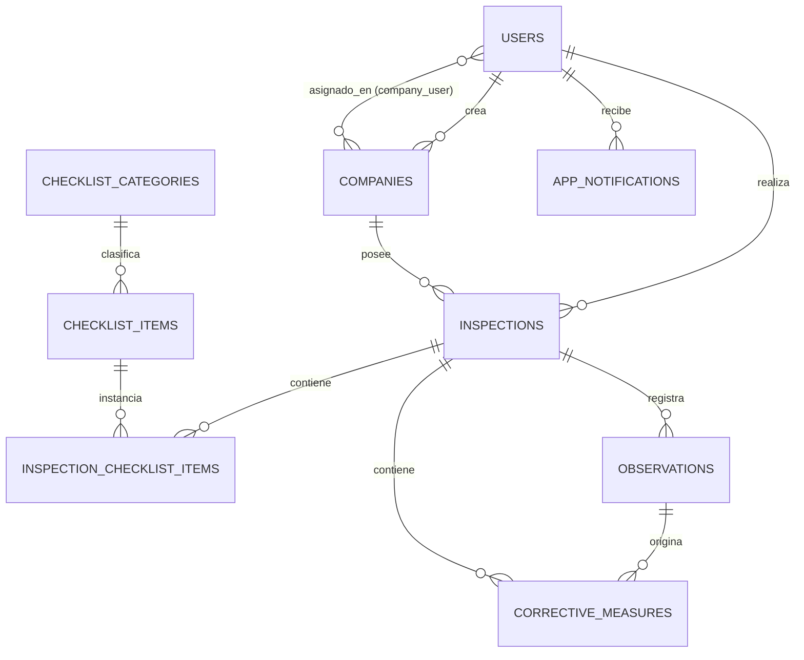

# Manual Técnico de Instalación, Configuración y Arquitectura
## Plataforma Web de Gestión Integral de Inspecciones de Higiene y Seguridad Laboral (HyS Control)
**Instituto de Educación Superior "Nuevo Horizonte"**  
**Carrera:** Tecnicatura Superior en Desarrollo de Software  
**Espacios Curriculares:** Práctica Profesionalizante I y II  
**Destinatarios:** Tecnicatura Superior en Seguridad e Higiene Laboral / Profesionales en Higiene y Seguridad

---

### 1. Ficha Técnica y Stack Tecnológico

| Componente | Tecnología | Versión | Descripción / Propósito |
| :--- | :--- | :--- | :--- |
| **Backend & API** | Laravel Framework | 12.x | Núcleo MVC, enrutamiento, transacciones y control de acceso RBAC. |
| **Lenguaje de Servidor** | PHP | 8.2+ / 8.4+ | Tipado estricto, atributos nativos y alto rendimiento. |
| **Puente SPA / Enlace** | Inertia.js | v2.0 (v3.3 Laravel) | Conecta controladores Laravel directamente con componentes React sin requerir APIs REST duplicadas. |
| **Frontend Framework** | React | 19.x | Single Page Application (SPA), renderizado dinámico e interactividad reactiva en tiempo real. |
| **Sistema de Estilos** | Tailwind CSS | v4.x | Diseño SaaS empresarial contemporáneo (*estilo Vercel/Linear/Stripe*), responsive mobile-first. |
| **Librería de Iconografía** | Lucide React | 1.x | Iconografía SVG vectorial moderna y consistente en toda la plataforma. |
| **Base de Datos** | MySQL / MariaDB | 8.0+ / 8.4+ | Almacenamiento relacional con claves foráneas, índices optimizados y borrado lógico (*Soft Deletes*). |
| **ORM** | Eloquent ORM | 12.x | Mapeo objeto-relacional seguro contra inyecciones SQL. |
| **Firma Digital (Fase II)** | HTML5 Canvas | Nativo | Captura interactiva táctil de firmas manuscritas de inspector y responsable en pantalla. |
| **Geolocalización (Fase II)** | Leaflet + OpenStreetMap | 1.9.4 | Trazado satelital interactivo en mapa y captura de coordenadas GPS con un solo clic (100% gratuito). |
| **Generador de Reportes** | Barryvdh DomPDF | 3.x | Maquetación y exportación de informes ejecutivos oficiales en formato PDF A4. |
| **Validación Dinámica QR** | QR Server API / UUID v4 | — | Código QR inalterable para verificación pública de autenticidad en cualquier smartphone. |

---

### 2. Arquitectura de la Solución (Laravel 12 + Inertia.js + React)

El sistema implementa una **Arquitectura SPA Monolítica Híbrida**. A diferencia de una arquitectura desacoplada tradicional (frontend y backend en servidores separados), esta arquitectura ofrece:
1. **Productividad Superior**: Se conservan todas las bondades de Laravel 12 (autenticación segura con sesiones cookies `HttpOnly`, validaciones de formularios tipadas, migraciones de base de datos y transacciones) pero con el frontend renderizado en **React 19**.
2. **Navegación Instantánea sin Recargas de Pantalla**: Las transiciones entre páginas son inmediatas gracias al enrutador cliente de Inertia.js, ofreciendo una experiencia idéntica a una aplicación nativa.
3. **Cero Complejidad de Tokens JWT y CORS**: No existe riesgo de filtración de tokens en `localStorage`, ya que la autenticación viaja de forma segura por cookies de sesión protegidas.

#### Estructura del Código Fuente
```text
sistema-inspecciones-hys/
├── app/
│   ├── Http/
│   │   ├── Controllers/          # Controladores que retornan respuestas Inertia::render()
│   │   │   ├── AuthController.php
│   │   │   ├── ChecklistController.php
│   │   │   ├── CompanyController.php
│   │   │   ├── CorrectiveMeasureController.php
│   │   │   ├── DashboardController.php
│   │   │   ├── InspectionController.php
│   │   │   ├── NotificationController.php
│   │   │   ├── ObservationController.php
│   │   │   ├── ReportController.php
│   │   │   └── UserController.php
│   │   └── Middleware/           # Control de roles (EnsureUserRole) y estado activo (EnsureUserIsActive)
│   └── Models/                   # Modelos Eloquent con relaciones y scopes
├── database/
│   ├── migrations/               # Esquema de base de datos relacional
│   └── seeders/                  # Seeders con usuarios, empresas e ítems normativos
├── resources/
│   ├── css/                      # Estilos globales con @import 'tailwindcss'
│   ├── js/
│   │   ├── Components/           # Componentes atómicos reutilizables (Badge, Modal, StatCard, SignatureCanvas, LeafletMap)
│   │   ├── Layouts/              # AuthenticatedLayout (Sidebar colapsable, Topbar, Notificaciones y Menú)
│   │   ├── Pages/                # Vistas principales en React (.jsx)
│   │   │   ├── Auth/             # Login.jsx, Profile.jsx
│   │   │   ├── Companies/        # Index.jsx, Show.jsx, Create.jsx, Edit.jsx
│   │   │   ├── Dashboard/        # Admin.jsx, Inspector.jsx
│   │   │   ├── Inspections/      # Index.jsx, Show.jsx (5 pestañas operativas), Create.jsx, Edit.jsx
│   │   │   ├── CorrectiveMeasures/# Index.jsx
│   │   │   ├── Users/            # Index.jsx, Create.jsx, Edit.jsx
│   │   │   ├── Notifications/    # Index.jsx
│   │   │   └── Reports/          # Verify.jsx (Certificado público QR)
│   │   └── app.jsx               # Punto de entrada de la aplicación React con Inertia
│   └── views/
│       ├── app.blade.php         # Plantilla raíz HTML5 de montaje Inertia
│       └── reports/pdf.blade.php # Plantilla del informe oficial para DomPDF
├── public/                       # Carpeta pública con bundles compilados (public/build)
├── entregables/                  # Documentación, script base_de_datos.sql y manuales
├── iniciar_sistema.bat           # Script de inicio rápido del servidor local
└── vite.config.js                # Configuración de compilación Vite con soporte React y Tailwind
```

---

### 3. Requerimientos del Servidor / Entorno de Desarrollo

- **Sistema Operativo:** Windows 10/11, Linux (Ubuntu/Debian) o macOS.
- **PHP:** Versión `>= 8.2` (Probado y validado en PHP 8.4) con las extensiones:
  - `pdo_mysql`, `mbstring`, `openssl`, `curl`, `fileinfo`, `gd`, `zip`.
- **Node.js:** Versión `>= 20.x` (Probado en Node.js v24.15 con NPM v11.12).
- **Gestor de Paquetes PHP:** Composer `>= 2.x`.
- **Motor de Base de Datos:** MySQL `>= 8.0` o MariaDB `>= 10.4` ejecutándose en el puerto estándar `3306`.

---

### 4. Procedimiento de Instalación y Puesta en Marcha

#### Paso 1: Clonar o extraer el proyecto
```bash
git clone <url-del-repositorio> sistema-inspecciones-hys
cd sistema-inspecciones-hys
```

#### Paso 2: Instalar Dependencias de PHP (Composer)
```bash
composer install
```

#### Paso 3: Instalar Dependencias de Frontend (NPM)
```bash
npm install
```
*(Nota en Windows PowerShell: si la política de scripts bloquea `npm`, utilizar `npm.cmd install`)*.

#### Paso 4: Configuración del Archivo de Entorno (`.env`)
Copiar el archivo `.env.example` a `.env` (si aún no existe) y configurar la conexión a base de datos:
```ini
APP_NAME="HyS Control"
APP_ENV=local
APP_KEY=base64:Lf/qkSl+kFiL05ZvdbHSuGrryci7ok9jIwJZdASc/10=
APP_DEBUG=true
APP_URL=http://127.0.0.1:8000

DB_CONNECTION=mysql
DB_HOST=127.0.0.1
DB_PORT=3306
DB_DATABASE=hys_control
DB_USERNAME=root
DB_PASSWORD=
```

Generar la clave de encriptación de la aplicación:
```bash
php artisan key:generate
```

#### Paso 5: Generar el Enlace Simbólico de Almacenamiento
Para permitir que las imágenes de evidencia fotográfica subidas por los inspectores sean accesibles públicamente:
```bash
php artisan storage:link
```

#### Paso 6: Creación de Base de Datos y Carga Inicial (Seeders)
Asegurarse de que el servicio de MySQL (XAMPP, Laragon o servicio local) esté iniciado. Luego ejecutar:
```bash
php artisan migrate:fresh --seed
```
*Este comando crea automáticamente todas las tablas relacionales y carga:*
- Los usuarios administradores e inspectores matriculados.
- Las categorías y los 30 ítems normativos estándar de checklists de higiene y seguridad (Ley 19.587, Dec. 351/79).
- Empresas de prueba (*Siderúrgica del Plata, Constructora Horizontes, Laboratorios BioQuim, Logística Austral*).
- Inspecciones de ejemplo en estado "Completada" y "En Progreso" con observaciones, fotos y medidas correctivas.

*Opción Alternativa Manual:* Se puede importar directamente el archivo `entregables/base_de_datos.sql` en phpMyAdmin o MySQL Workbench.

#### Paso 7: Compilación de los Activos de React
Para compilar la aplicación para producción:
```bash
npm run build
```
*(O `npm run dev` si se desea desarrollo con recarga en caliente HMR).*

#### Paso 8: Iniciar el Servidor Web Local
Ejecutar el servidor integrado de Laravel:
```bash
php artisan serve
```
O simplemente hacer doble clic en el archivo `iniciar_sistema.bat`.

Abrir el navegador web en: **`http://127.0.0.1:8000`**

---

### 5. Cuentas de Acceso y Credenciales de Prueba

| Perfil | Rol en Sistema | Correo Electrónico | Contraseña | Matrícula / Función |
| :--- | :--- | :--- | :--- | :--- |
| **Administrador General** | `admin` | **`admin@hys.com`** *(o admin@seguridad.local)* | **`admin123`** *(o password)* | MAT-NAC-00192 (Gestión global de la plataforma) |
| **Inspector Técnico** | `inspector` | **`inspector@hys.com`** *(o inspector@seguridad.local)* | **`inspector123`** *(o password)* | LIC-HYS-8492 (Evaluador operativo en campo) |
| **Inspectora Técnica 2** | `inspector` | **`maria@seguridad.local`** | **`password`** | LIC-HYS-3120 (Inspectora asignada a BioQuim) |

---

### 6. Modelo de Base de Datos y Entidades Principales



1. **`users`**: Administradores e inspectores matriculados con campo `role`, `license_number` y bandera de estado `is_active`.
2. **`companies`**: Establecimientos industriales y de servicios sujetos a auditorías con soporte de *Soft Deletes*.
3. **`company_user`**: Tabla pivote relacional para la asignación de múltiples inspectores a cada empresa.
4. **`checklist_categories`** y **`checklist_items`**: Catálogo base de normativas técnicas (Edilicio, Eléctrico, Incendio, EPP, Ergonomía, etc.).
5. **`inspections`**: Cabecera de auditorías con fecha, tipo, estado (*Borrador, En Progreso, Completada, Cancelada*), porcentaje de avance calculado, firmas electrónicas manuscritas en base64 y token UUID único para QR.
6. **`inspection_checklist_items`**: Ítems evaluados con estados `Cumple`, `No Cumple`, `No Aplica`, `Pendiente`, nivel de riesgo (*Bajo, Medio, Alto*) y notas.
7. **`observations`**: Registro de desvíos, actos inseguros o buenas prácticas, con severidad (*Menor, Moderado, Mayor, Crítico*), ubicación física y array JSON de fotos de evidencia.
8. **`corrective_measures`**: Planes de mitigación técnica con prioridad, fecha límite de cumplimiento, responsable asignado, costo estimado y seguimiento de estado (*Pendiente, En Progreso, Completada, Vencida*).

---

### 7. Medidas de Seguridad Web Implementadas

1. **Control de Acceso Basado en Roles (RBAC)**: Middleware `role:admin` que restringe el módulo de usuarios y funciones críticas exclusivamente a cuentas de administración.
2. **Control de Inactividad y Estado de Cuenta**: Middleware `active` que verifica que la cuenta del usuario no haya sido deshabilitada antes de conceder acceso a las rutas protegidas.
3. **Firmas y Trazabilidad Inalterable**: Las firmas manuscritas capturadas en el componente Canvas se persisten en base de datos y se embeben directamente en el informe PDF, impidiendo su edición posterior al cerrarse el acta.
4. **Validación QR con Criptografía UUID**: Cada informe genera un token UUID v4 público (`/verify/{token}`) que permite a inspectores externos o autoridades corroborar la autenticidad del documento sin necesidad de iniciar sesión.
5. **Protección contra Inyecciones SQL y XSS**: Laravel Eloquent utiliza sentencias preparadas PDO parametrizadas, y React escapa de forma predeterminada cualquier cadena en el DOM impidiendo ataques de Cross-Site Scripting.

---

### 8. Solución a Preguntas y Problemas Frecuentes

- **Error: `SQLSTATE[HY000] [1049] Unknown database 'hys_control'`**:
  Indica que la base de datos no existe en MySQL. Ejecutar en consola o phpMyAdmin: `CREATE DATABASE hys_control CHARACTER SET utf8mb4 COLLATE utf8mb4_unicode_ci;` y luego correr `php artisan migrate:fresh --seed`.
- **Error de ejecución de scripts de PowerShell en Windows (`npm.ps1 cannot be loaded`)**:
  En Windows, ejecutar el comando agregando la extensión `.cmd`: `npm.cmd install` o `npm.cmd run build`.
- **Las imágenes de evidencia no se visualizan**:
  Verificar que se haya ejecutado el comando `php artisan storage:link` para crear el enlace simbólico de la carpeta `storage/app/public` a `public/storage`.
