# Manual de Usuario de la Plataforma HyS Control
## Guía de Operación para Alumnos, Docentes e Inspectores de Higiene y Seguridad Laboral
**Instituto de Educación Superior "Nuevo Horizonte"**  
**Carrera:** Tecnicatura Superior en Desarrollo de Software / Tecnicatura Superior en Seguridad e Higiene Laboral  
**Versión del Sistema:** 2.0 (React 19 + Tailwind CSS + Laravel 12)

---

### 1. Introducción y Propósito de la Plataforma

**HyS Control** es una plataforma web moderna de nivel empresarial diseñada específicamente para digitalizar, estructurar y agilizar el trabajo de campo de los profesionales y técnicos en Seguridad e Higiene Laboral.

La plataforma sustituye las planillas en papel tradicionales y las hojas de cálculo estáticas por una experiencia ágil, visual y táctil optimizada para teléfonos móviles, tablets y computadoras portátiles:
- **Evaluación en Tiempo Real**: Cálculo dinámico del porcentaje de avance y de la tasa de conformidad legal.
- **Checklists Técnicos Normativos**: Estandarizados según la Ley Nacional 19.587, Decreto 351/79, Decreto 911/96 y Resoluciones de la SRT.
- **Evidencia Fotográfica Integrada**: Carga de fotografías de hallazgos y condiciones subestándar directamente desde la cámara del dispositivo móvil.
- **Firma Digital Manuscrita en Pantalla**: Módulo interactivo táctil para la rúbrica del inspector y del representante de la empresa en el lugar de los hechos.
- **Geolocalización GPS y Mapa Interactivo**: Registro de coordenadas satelitales del establecimiento inspeccionado.
- **Informes Ejecutivos en PDF con Código QR**: Generación con un solo clic de informes oficiales con sellos de autenticidad pública.

---

### 2. Roles de Usuario y Perfiles de Acceso

La plataforma cuenta con control de acceso basado en roles (**RBAC**):

#### A. Perfil Administrador (`admin`)
- **Visión Global y Analítica**: Acceso al panel de control general con estadísticas consolidadas, ranking de empresas y evolución mensual de auditorías.
- **Gestión del Cuerpo Técnico**: Alta, edición y habilitación/deshabilitación inmediata de inspectores matriculados.
- **Padrón de Empresas**: Capacidad de restaurar empresas desde la papelera de reciclaje (*Soft Delete*) y reasignar técnicos.
- **Exportaciones Masivas**: Descarga del padrón histórico completo en formato Excel (CSV).

#### B. Perfil Inspector Técnico (`inspector`)
- **Espacio de Trabajo en Terreno**: Panel optimizado para visualizar únicamente las empresas e inspecciones que tiene asignadas.
- **Alta de Establecimientos**: Posibilidad de registrar nuevos clientes o plantas industriales sobre las cuales deba intervenir.
- **Ejecución de Auditorías**: Evaluación de ítems de checklist, registro de hallazgos fotográficos y formulación de planes de acción.
- **Rúbrica y Cierre de Actas**: Firma digital manuscrita en pantalla y emisión inmediata del informe en PDF para entregar al cliente.

---

### 3. Guía de Operación Paso a Paso

```mermaid
flowchart LR
    A["1. Inicio de Sesión"] --> B["2. Dashboard Operativo"]
    B --> C["3. Selección o Alta de Empresa"]
    C --> D["4. Inicio de Inspección"]
    D --> E["5. Checklist Técnico"]
    E --> F["6. Fotos & Observaciones"]
    F --> G["7. Medidas Correctivas"]
    G --> H["8. Firma Digital en Canvas"]
    H --> I["9. Generación de PDF Oficial"]
    I --> J["10. Validación Pública QR"]
```

---

#### 3.1. Inicio de Sesión y Acceso al Sistema

1. Abra el navegador web e ingrese a la dirección del sistema: **`http://127.0.0.1:8000`** (o `/login`).
2. En pantalla observará la interfaz de inicio de sesión con diseño moderno.
3. Ingrese su correo electrónico y contraseña asignada:
   - **Administrador:** `admin@hys.com` (Contraseña: `admin123`)
   - **Inspector:** `inspector@hys.com` (Contraseña: `inspector123`)
4. *Acceso Rápido para Demostraciones:* En la parte inferior del formulario encontrará los botones **"Como Admin"** y **"Como Inspector"**, los cuales rellenan automáticamente las credenciales correspondientes.
5. Presione el botón **"Ingresar al Sistema"**.

---

#### 3.2. Navegación por el Panel de Control (Dashboard)

Al ingresar, el sistema identificará su rol y cargará el panel correspondiente:

##### Si ingresa como Administrador:
- **Tarjetas KPI**: Cantidad de empresas registradas, total de inspecciones finalizadas, medidas correctivas pendientes y número de inspectores activos.
- **Alerta de Medidas Vencidas**: Si existen medidas de seguridad que han superado su fecha límite sin resolverse, se desplegará un banner rojo de advertencia prioritaria con acceso directo al listado.
- **Gráfico Mensual de Inspecciones**: Muestra en barras interactivas el volumen de auditorías realizadas en los últimos 6 meses.
- **Desglose de Estados**: Indicador porcentual de inspecciones en estado *Completada*, *En Progreso*, *Borrador* o *Cancelada*.

##### Si ingresa como Inspector Técnico:
- **Métricas Personales**: Historial de auditorías asignadas y pendientes del profesional.
- **Acceso Directo en Terreno**: Botón destacado **"Iniciar Inspección en Terreno"** para abrir una nueva planilla de evaluación.
- **Empresas Asignadas**: Listado rápido de los clientes donde el profesional está habilitado para ingresar a auditar.

---

#### 3.3. Gestión de Empresas y Establecimientos

1. En la barra lateral izquierda, haga clic en **"Empresas"**.
2. **Búsqueda y Filtros**: Puede escribir la razón social, CUIT, contacto o dirección en el buscador en vivo, o filtrar por sector industrial (*Metalmecánica, Construcción, Química, Alimentos, etc.*).
3. **Registrar Nueva Empresa**:
   - Presione el botón azul **"Nueva Empresa"**.
   - Complete la Razón Social, CUIT/RUC, Sector Industrial, Dirección física de la planta, teléfono, persona de contacto y cantidad de empleados.
   - **Asignación de Inspectores**: Marque las casillas de los técnicos matriculados que tendrán permiso para inspeccionar la empresa.
   - Presione **"Registrar Empresa"**.
4. **Ficha Técnica de la Empresa**:
   - Al hacer clic sobre cualquier empresa, accederá a su perfil detallado con sus datos fiscales, inspectores habilitados y el historial cronológico completo de todas sus auditorías pasadas.

---

#### 3.4. Creación de una Nueva Inspección

1. Haga clic en **"Nueva Inspección"** (disponible desde el menú lateral, desde el Dashboard o desde la ficha de la empresa).
2. Seleccione el establecimiento a inspeccionar en el menú desplegable.
3. Configure la **Fecha de Auditoría** y el **Tipo de Inspección**:
   - **General:** Relevamiento integral de las instalaciones.
   - **Específica:** Focalizada en un riesgo particular (ej. riesgo eléctrico, trabajo en altura o máquinas).
   - **Seguimiento:** Verificación de medidas correctivas implementadas.
4. Indique los horarios de inicio y cierre previstos y un alcance preliminar.
5. Presione **"Crear e Iniciar Evaluación"**.
6. *Automatización del Sistema:* El motor generará automáticamente todos los ítems normativos clasificados en los ejes técnicos aplicables (Seguridad edilicia, Instalaciones eléctricas, Protección contra incendios, EPP, Ergonomía, Orden y limpieza, etc.).

---

#### 3.5. Auditoría en Terreno: El Centro Operativo (5 Pestañas)

Al abrir la inspección, observará la cabecera con el porcentaje de avance (0% a 100%) y 5 pestañas de trabajo:

##### Pestaña 1: Checklist Técnico
- Cada punto de la normativa presenta **4 botones táctiles grandes**, diseñados especialmente para no equivocarse al manipular la pantalla en campo:
  - **`[ ✓ Cumple ]` (Verde Esmeralda):** La condición observada se ajusta a la ley y a las normas IRAM.
  - **`[ ✕ No Cumple ]` (Rojo Carmesí):** Se detectó una no conformidad o condición subestándar. *Al seleccionarlo, se desplegará una alerta rápida que le permite cargar la foto y generar la medida correctiva con un solo clic.*
  - **`[ — No Aplica ]` (Gris Neutro):** El riesgo evaluado no existe en ese sector o puesto.
  - **`[ ⏳ Pendiente ]` (Ámbar):** El ítem aún no fue verificado.
- **Nivel de Riesgo**: Puede clasificar cada desvío como riesgo **Bajo**, **Medio** o **Alto**.
- **Agregar Ítems Personalizados**: Si la planta presenta una máquina o riesgo específico no listado, pulse **"Agregar Ítem"** e ingrese la descripción y referencia normativa deseada.
- *Cálculo en Tiempo Real:* A medida que evalúa los ítems, la barra superior actualiza de inmediato el avance y la tasa global de conformidad legal.

##### Pestaña 2: Observaciones & Evidencias Fotográficas
- Presione **"Nueva Observación"** para documentar un hallazgo en terreno.
- Seleccione la clasificación (**Hallazgo**, **Buena Práctica** o **Mejora**) y la severidad (**Menor**, **Moderado**, **Mayor** o **Crítico**).
- Indique la ubicación física exacta dentro de la planta (ej. *Nave 2 - Taller de Soldadura*).
- Escriba la descripción técnica del peligro o incumplimiento.
- **Carga de Fotos Múltiple**: Adjunte las fotos tomadas en el lugar.
- **Visor Lightbox**: Al hacer clic sobre cualquier miniatura en la galería, la foto se ampliará a pantalla completa en alta resolución para una inspección visual detallada.
- **Función Medida Directa**: Puede marcar la casilla *"Generar Medida Correctiva Inmediata"* para establecer la solución técnica en el mismo formulario.

##### Pestaña 3: Medidas Correctivas
- Consolida el plan de acción preventivo y correctivo de la empresa.
- Cada medida detalla:
  - Acción requerida para subsanar el peligro.
  - Nivel de prioridad (*Crítica, Alta, Media, Baja*).
  - Responsable asignado en la empresa.
  - Fecha límite de implementación (el sistema alertará si vence).
  - Costo estimado en pesos argentinos.
  - **Selector de Estado en Vivo**: Cambie el estado a *Pendiente*, *En Progreso* o *Completada*.

##### Pestaña 4: Firma Digital y Cierre del Acta
- Permite formalizar el acta con validez legal antes de retirarse de la empresa.
- **Canvas Táctil del Inspector**: El profesional dibuja su firma directamente sobre la pantalla con el dedo o el mouse.
- **Canvas Táctil de la Empresa**: El responsable del establecimiento (ej. Gerente de Planta o Jefe de Seguridad) ingresa su nombre y estampa su firma manuscrita de conformidad.
- Presione **"Guardar y Estampar Firmas en Informe"**. Las firmas se almacenan de manera segura y se insertarán en el informe PDF.

##### Pestaña 5: Geolocalización GPS y Mapa Satelital
- Permite verificar la localización física de la auditoría.
- Presione el botón **"Usar mi GPS actual"**. El navegador capturará las coordenadas de latitud y longitud en tiempo real.
- Podrá interactuar con el mapa de OpenStreetMap, acercar el zoom o arrastrar el marcador al punto exacto de la nave o predio auditado.

---

#### 3.6. Finalización y Descarga del Informe Oficial en PDF

1. Una vez completada la evaluación técnica y registradas las firmas, presione el botón **"Finalizar y Cerrar"** en la parte superior derecha.
2. Haga clic en **"Descargar Informe PDF"**.
3. El sistema descargará un archivo PDF formal estructurado para entrega institucional que contiene:
   - Portada con membrete oficial, datos de la empresa, CUIT y matrícula del inspector.
   - Resumen ejecutivo con gráficos circulares y métricas de cumplimiento legal.
   - Tabla completa y pormenorizada de todos los ítems evaluados del checklist.
   - Registro de observaciones técnicas con las fotografías de evidencia integradas.
   - Matriz de medidas correctivas con sus fechas de vencimiento y responsables.
   - Espacio formal con las **firmas digitales manuscritas estampadas**.
   - **Código QR dinámico de autenticidad inalterable**.

---

#### 3.7. Validación Pública de Autenticidad por Código QR

Cualquier auditor externo, funcionario de la Secretaría de Trabajo, perito o representante de una ART puede escanear con la cámara de su teléfono móvil el código QR impreso al pie del informe PDF.

Al escanearlo, será dirigido de inmediato a la pantalla pública de verificación oficial (**`/verify/{token}`**), donde podrá constatar:
- La razón social y CUIT de la empresa auditada.
- El nombre y número de matrícula profesional del inspector responsable.
- La fecha y horario de realización del acta.
- La tasa de conformidad y la confirmación de firmas digitales registradas, garantizando que el documento físico no ha sido falsificado ni adulterado.

---

#### 3.8. Exportación de Datos a Microsoft Excel (CSV)

Para tareas de auditoría administrativa o presentación de informes masivos:
1. En la barra lateral izquierda, haga clic en **"Exportar a Excel (CSV)"**.
2. El sistema generará y descargará automáticamente un archivo CSV codificado en UTF-8 (con BOM) compatible directamente con Microsoft Excel, que consolida todas las inspecciones realizadas, avances, empresas y matrículas.

---

#### 3.9. Centro de Notificaciones y Alertas

En la esquina superior derecha, junto a su nombre de usuario, encontrará el icono de campana con el contador de notificaciones pendientes:
- Alertas de medidas correctivas con fecha límite próxima a vencer (menos de 72 horas).
- Notificaciones de no conformidades críticas registradas.
- Alertas de nuevas empresas e inspecciones asignadas.
- Posibilidad de marcar avisos como leídos individualmente o con el botón **"Marcar todas como leídas"**.
